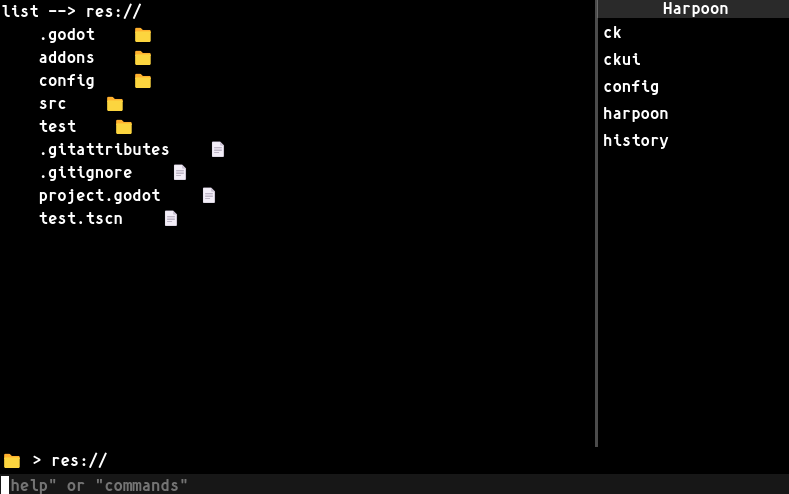
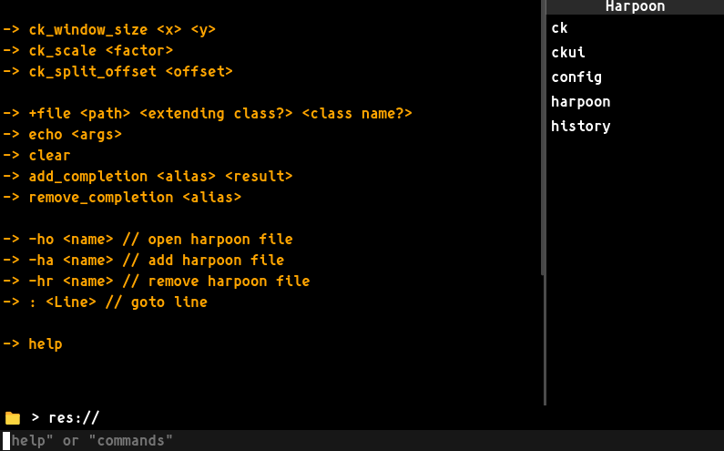

# CleverKeys 👓🔑

A keyboard driven CLI inside of Godot Engine (sort of...)

# Installation
1. Download or clone the repository
2. Copy the folder into your "addons" directory
3. Enable **Clever Keys** in the project settings!
*Project -> Project Settings -> Plugins*

# Usage
You can press *Ctrl + Shift + C* to toggle it, or you can use *F3* for the same porpuse, you can also close the UI with *ESC*

# DISCLAIMER
this is version *0.0.1* FOR A REASON, commands may be missing or crashes might happen, please report them to me so I can fix them! Here's a little roadmap of things I want to add

- Themes?
- Customization
- Custom scripts (sort of plugins for Clever Keys)
- Better UI
- More bash commands
    - move
    - delete?
    - mkdir
    - git support on console? (can I even do that in gdscript?...)